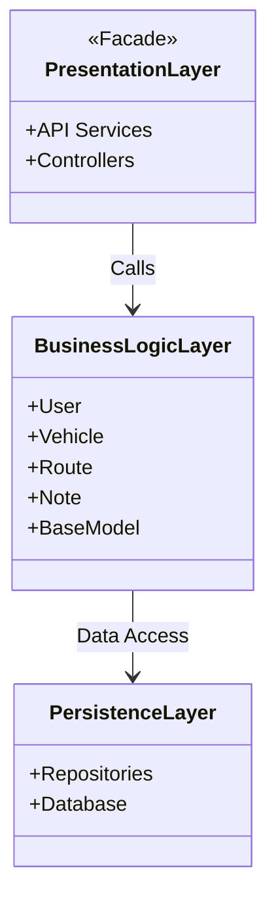
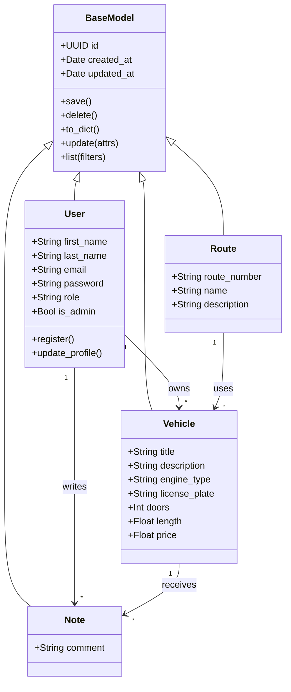
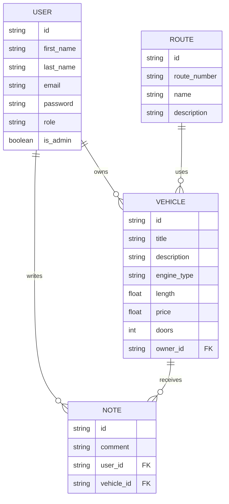
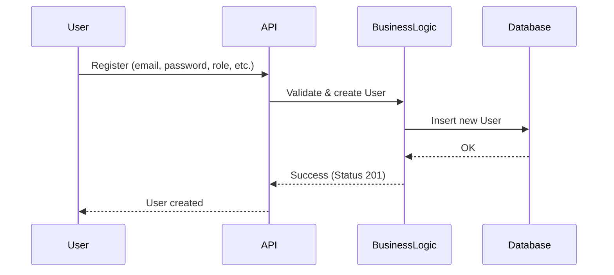
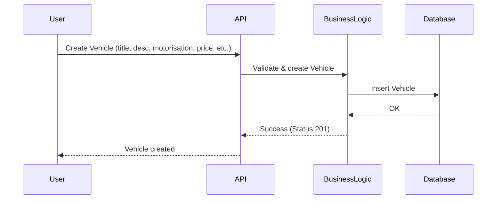
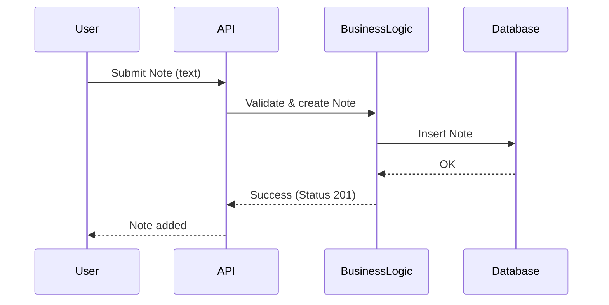
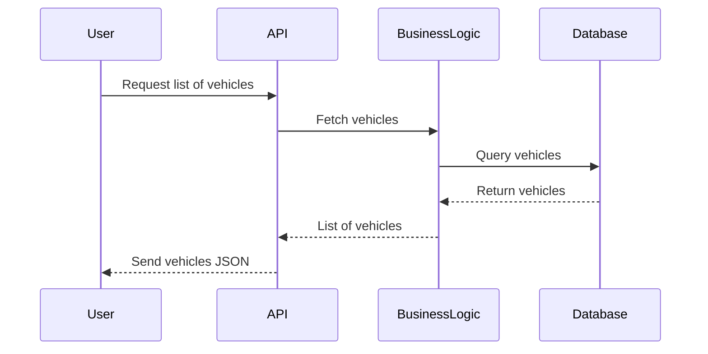

# Portfolio Technical Documentation

## User Stories

**Admin**
-   “As an admin, I want to supervise the fleet, so that I can manage budgets and contracts effectively.”
-   The admin must have access to all strategic data and reports. No restrictions apply.

**Manager**
-   “As a manager, I want to define, manage and schedule planning, so that I can manage vehicle availability easily.”
-   The manager must have access to the full fleet and its availability, and to a schedule they can modify. They will not have access to strategic financial data.

**Technician**
-   “As a technician, I want to track interventions and repairs, so that I can ensure vehicles remain operational.”
-   The technician will have access to details about each vehicle, including reports, issues, notes, and alerts. They will not have access to budgets or contracts.

**Driver**
-   “As a driver, I want to drive a safe vehicle, so that I can transport passengers without incidents or technical issues.”
-   The driver will have access to routes, schedules, and status alerts, and can submit complaints or requests. They will not have access to fleet management or strategic data.

## Design System Architecture

## Components, classes and database
**Classes diagram**

**ER diagram**

## High-Level Sequence Diagrams
**User Registration**

Note: A user can select between one of these three roles during registration: manager, technician, or driver. The admin role is reserved for the first created account.

**Create a new vehicle**

**Add a new note**

**Fetching a list of vehicles**

